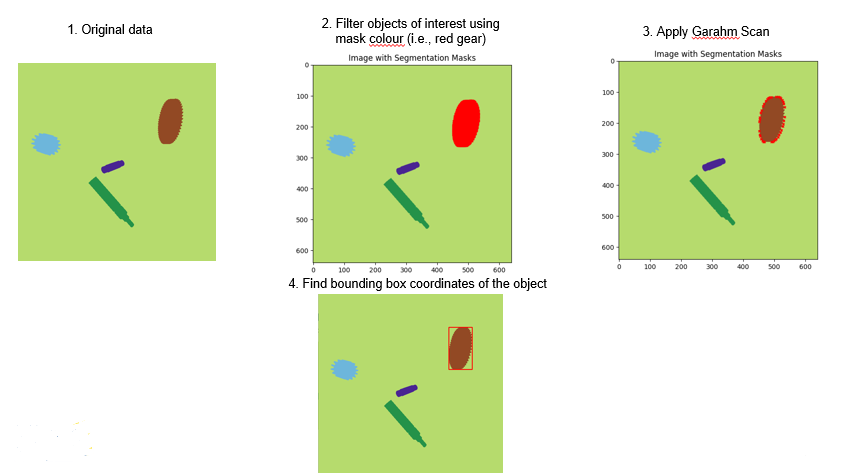
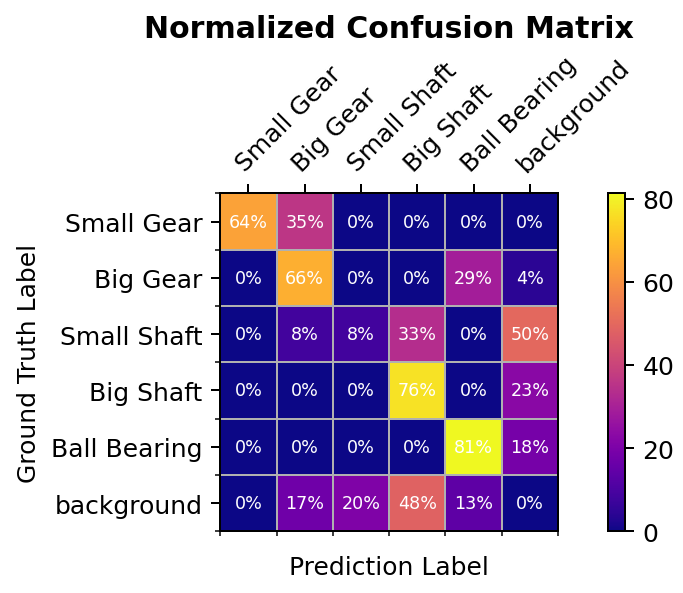

NDDS Image Segmentation Labeling Algorithm
===============================================

Overview
--------

This paper proposes a novel algorithm which makes use of the RGB mask produced by NDDS to obtain a polygon outline of the object of interest and save it to an annotation file. Our algorithm uses Graham scan to find the smallest convex hull around the region of pixels masking the object of interest. This enables rapid annotation for image segmentation algorithms which are by nature laboriously intensive to annotat

Results
----------
The findings of this paper show that it is possible to train an image segmentation model using our customized algorithm, even with non-convex components. For a total of 2269 images across 5 classes of components, our algorithm yielded a labeling time of 0.28 seconds per image. Classes with minimal features tended to be under generalized and harder to detect in the real world. However, this problem is more likely associated with the inherent inaccuracies of synthetic data, and not the labeling algorithm itself. In this study, RTMDet-Ins-x was trained on synthetic data generated from NDDS with our algorithm. with the annotated The training results manifest good precision and accuracy in localization and classification even with non-convex components, proving the potential for further research.

Below is a demo of the trained model deployed to an RGB webcam.

The corresponding confusion matrix is depicted below.

Weights download: https://drive.google.com/file/d/1jEOkb2fChfEgdbDUjm1SMczIcqp30mvn/view?usp=sharing
Dataset download: https://drive.google.com/file/d/17aNPGHRzC_I8Fl_LemScNDyLJEr7kXr7/view?usp=sharing

References
----------
[1] T. M. Inc., “What is object detection?,” 2022.

[2] T. M. Inc., “What is image segmentation?,” 2022.

[3] I. Rasmussen, S. Kvalsvik, P.-A. Andersen, T. N. Aune, and D. Hagen, “Development of a novel object detection system based on synthetic data generated from unreal game engine,” Applied Sciences, vol. 12, no. 17, 2022.

[4] T. To, J. Tremblay, D. McKay, Y. Yamaguchi, K. Leung, A. Balanon, J. Cheng, W. Hodge, and S. Birchfield, “NDDS: NVIDIA deep learn-ing dataset synthesizer,” 2018. https://github.com NVIDIA/Dataset Synthesizer.

[5] C. Lyu, W. Zhang, H. Huang, Y. Zhou, Y. Wang, Y. Liu, S. Zhang, and K. Chen, “Rtmdet: An empirical study of designing real-time object detectors,” arXiv preprint arXiv:2212.07784, 2022.

[6] K. Xiao, L. Engstrom, A. Ilyas, and A. Madry, “Noise or signal: The role of image backgrounds in object recognition,” arXiv preprint arXiv:2006.09994, 2020.

[7] N. Dvornik, J. Mairal, and C. Schmid, “Modeling visual context is key to augmenting object detection datasets,” in Proceedings of the European Conference on Computer Vision (ECCV), pp. 364–380, 2018.

[8] D. Dwibedi, I. Misra, and M. Hebert, “Cut, paste and learn: Surpris-ingly easy synthesis for instance detection,” in Proceedings of the IEEE international conference on computer vision, pp. 1301–1310, 2017.

[9] A. Ba ́ıllo and J. E. Chac ́on, “Chapter 1 - statistical outline of animal home ranges: An application of set estimation,” in Data Science: Theory and Applications (A. S. Srinivasa Rao and C. Rao, eds.), vol. 44 of Handbook of Statistics, pp. 3–37, Elsevier, 2021.

[10] A. Biswas, P. Bhowmick, M. Sarkar, and B. B. Bhattacharya, “A linear-time combinatorial algorithm to find the orthogonal hull of an object on the digital plane,” Information Sciences, vol. 216, pp. 176–195, 2012.